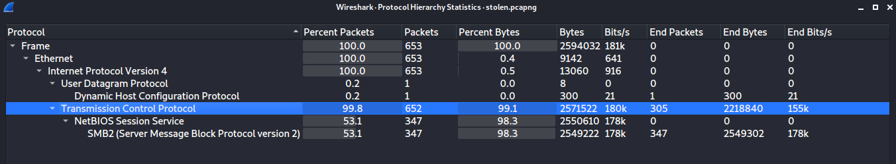
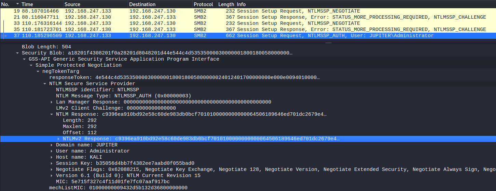
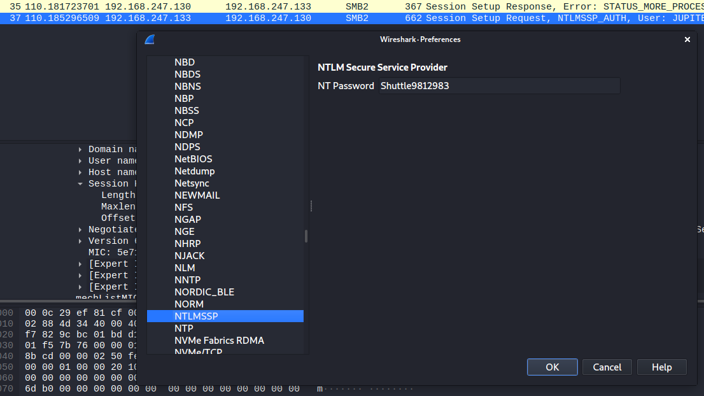
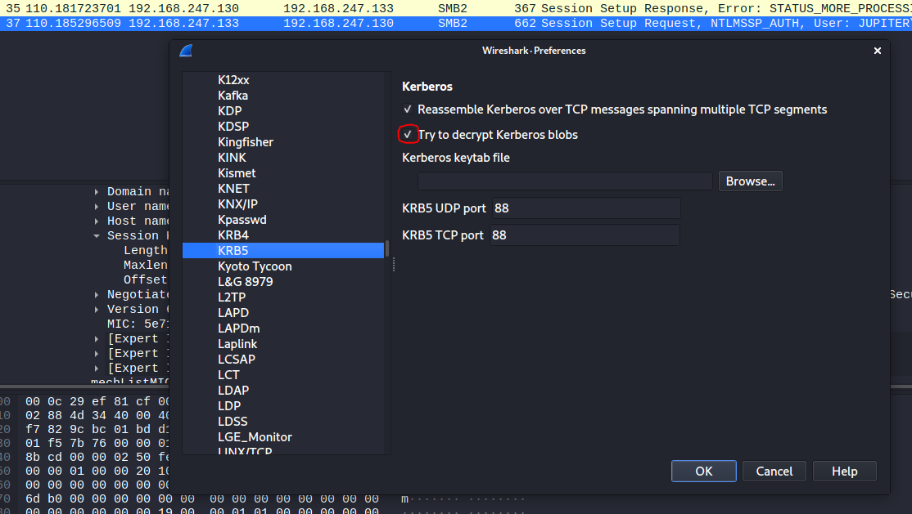

# Stolen Research

## Challenge Description:

A malicious actor has broken into our research centre and has stolen some important information. Help us investigate their confiscated laptop memory dump!  
Note: if you need to crack passwords during this challenge, all potential passwords apear in rockyou-75.txt.  
Note 2: the pcap is only relevant for the last subtask.   
Note 3: do NOT attempt to brute-force rockyou75.txt against the flag submission - it will get your IP banned.

#### Files:

* memdump.vmem.7z
* stolen.pcapng

### Subtask 1 - Kernel Release

#### Description:

What sort of OS and kernel is the actor using? Give us the kernel release version \(the output of the 'uname -r' command\).

#### Solution:

Given the 'hint' of uname we will asume at least an unix-like OS, so lets start with Linux.  
This [post](https://stackoverflow.com/questions/47065485/is-it-possible-to-figure-linux-kernel-version-from-a-snapshot-of-system-physical) is helpful.  
So, checking out the [source](https://github.com/torvalds/linux/blob/master/init/version.c) we see that the string literal `"Linux version"`looks like a good grep candidate.

```c
const char linux_banner[] =
	"Linux version " UTS_RELEASE " (" LINUX_COMPILE_BY "@"
	LINUX_COMPILE_HOST ") (" LINUX_COMPILER ") " UTS_VERSION "\n";
```

The following command will scan the memory dump in search of the Linux banner, piping it to uniq will give a clearer output.

```bash
strings memdump.vmem | grep -i 'Linux version' | uniq
```

Output:  
Operating System = Linux version 5.10.0-kali8-amd64 running on amd64 Linux version **5.10.0-kali8-amd64** \(devel@kali.org\) \(gcc-10 \(Debian 10.2.1-6\) 10.2.1 20210110, GNU ld \(GNU Binutils for Debian\) 2.35.2\) \#1 SMP Debian 5.10.40-1kali1 \(2021-05-31\) Raptor 4000-L \[Linux version\] Raptor 4000-LR-L \[Linux version\] MESSAGE=Linux version 5.10.0-kali8-amd64 \(devel@kali.org\) \(gcc-10 \(Debian 10.2.1-6\) 10.2.1 20210110, GNU ld \(GNU Binutils for Debian\) 2.35.2\) \#1 SMP Debian 5.10.40-1kali1 \(2021-05-31\) Linux version 5.10.0-kali8-amd64 \(devel@kali.org\) \(gcc-10 \(Debian 10.2.1-6\) 10.2.1 20210110, GNU ld \(GNU Binutils for Debian\) 2.35.2\) \#1 SMP Debian 5.10.40-1kali1 \(2021-05-31\)

**Flag:**  **5.10.0-kali8-amd64**

### Subtask 2 - Tooling

#### Description:

Hope you made a good custom profile in the meantime... The attacker is using some tooling for reconnaissance purposes. Give us the parent process ID, process ID, and tool name \(not the process name\) in the following format: PPID\_PID\_NAME

#### Solution:

First, we need to make a Volatility profile for the kernel we found in the previous subtask to access the memory dump contents.  
Lets start installing volatility and dwarfdump.  
[Volatility docs](https://github.com/volatilityfoundation/volatility/wiki/Linux-Command-Reference).

```bash
apt install dwarfdump
git clone --depth=1 https://github.com/volatilityfoundation/volatility
cd volatility
python setup.py install
```

We need to download the necessary packages for building the kernel profile from [this site](http://kali.download/kali/pool/main/l/linux/).

* linux-headers-5.10.0-kali8-amd64\_5.10.40-1kali1\_amd64.deb
* linux-headers-5.10.0-kali8-common\_5.10.40-1kali1\_all.deb
* linux-image-5.10.0-kali8-amd64\_5.10.40-1kali1\_amd64.deb
* linux-kbuild-5.10-dbgsym\_5.10.40-1kali1\_amd64.deb

Install these packages with `dpkg -i linux-*`.  
Then, generate the 'module.dwarf' file and zip it with the kernel system map to create the volatility profile.

```bash
cd ~/volatility/tools/linux/
make

zip kali_5-10-40.zip volatility/tools/linux/module.dwarf /usr/lib/debug/boot/System.map-5.10.0-kali8-amd64
cp kali_5-10-40.zip volatility/volatility/plugins/overlays/linux

# check profile
cd ~/volatility
python2 vol.py --info | grep 5.10
Volatility Foundation Volatility Framework 2.6.1
Linuxkali_5-10-40x64   - A Profile for Linux kali_5-10-40 x64

```

As a bonus we will also make a profile for volatility3 using [dwarf2json](https://github.com/volatilityfoundation/dwarf2json).

```bash
git clone https://github.com/volatilityfoundation/volatility3.git
git clone https://github.com/volatilityfoundation/dwarf2json
cd dwarf2json
go build

./dwarf2json linux --elf /usr/lib/debug/boot/vmlinux-5.10.0-kali8-amd64 --system-map /usr/lib/debug/boot/System.map-5.10.0-kali8-amd64 | xz -c > kali-5-10-40.json.xz

cp kali-5-10-40.json.xz ~/volatility3/volatility3/plugins/linux/

# check profile
cd ~/volatility3
python3 vol.py isfinfo.IsfInfo --filter kali-5-10-40.json.xz
Volatility 3 Framework 1.1.1
Progress:  100.00               PDB scanning finished  
URI     Valid   Number of base_types    Number of types Number of symbols       Number of enums Windows info       Linux banner    Mac banner

file:///home/kali/volatility3/volatility3/symbols/linux/kali-5-10-40.json.xz    Unknown 18      8728       143942  1512    -       Linux version 5.10.0-kali8-amd64 (devel@kali.org) (gcc-10 (Debian 10.2.1-6) 10.2.1 20210110, GNU ld (GNU Binutils for Debian) 2.35.2) #1 SMP Debian 5.10.40-1kali1 (2021-05-31)

```

We finally have volatility setup, so lets start looking for the reconnaissance tool.  
Lets start with bash history.

```bash
# Volatility
python2 ~/volatility/vol.py -f memdump.vmem --profile Linuxkali_5-10-40x64 linux_bash

Pid      Name                 Command Time                   Command
-------- -------------------- ------------------------------ -------
    1058 bash                 2021-07-01 10:32:09 UTC+0000   exit
    1058 bash                 2021-07-01 10:32:09 UTC+0000   bash
    1058 bash                 2021-07-01 10:32:09 UTC+0000   history
    1058 bash                 2021-07-01 10:32:09 UTC+0000   sudo reboot
    1058 bash                 2021-07-01 10:32:09 UTC+0000   history
    1058 bash                 2021-07-01 10:32:09 UTC+0000   sudo reboot
    1058 bash                 2021-07-01 10:32:09 UTC+0000   id
    1058 bash                 2021-07-01 10:32:09 UTC+0000   passwd
    1058 bash                 2021-07-01 10:32:09 UTC+0000   exit
    1058 bash                 2021-07-01 10:32:29 UTC+0000   maltego <- !!
    1254 bash                 2021-07-01 10:33:50 UTC+0000   passwd

# Volatility 3
python3 vol.py -f ~/Stolen_Research/memdump.vmem linux.bash.Bash  
Volatility 3 Framework 1.1.1
Progress:  100.00               Stacking attempts finished                 
PID     Process CommandTime     Command
........
1058    bash    2021-07-01 10:32:29.000000      maltego
........ 
```

  
We see _**maltego**_ on the list, __an OSINT tool. Lets get the processes tree to find the PPID, keeping in mind that maltego uses java.

```bash
# Volatility
python2 ~/volatility/vol.py -f memdump.vmem --profile Linuxkali_5-10-40x64 linux_pstree
........          
.qterminal           1055            1001
..bash               1058            1001
...bash              1082 <- PPID    1001
....java             1208 <- PID     1001
........

# Volatility 3
python3 vol.py -f ~/Stolen_Research/memdump.vmem linux.pstree.PsTree
Volatility 3 Framework 1.1.1
Progress:  100.00               Stacking attempts finished                 
PID     PPID    COMM
........
* 1055  1       qterminal
** 1058 1055    bash
*** 1082        1058    bash
**** 1208       1082    java
........
```

**Flag:  1082\_1208\_maltego**

### Subtask 3 - Password of the actor

#### Description:

What is the password of the actor?

#### Solution:

Given that we have a Linux memory dump lets try get the password from _**/etc/passwd**_ and _**/etc/shadow**_.  
Volatility allows to search for files or retrieve all the contents of the dump. As we probably may need them for the other subtasks, lets get all the files.

```bash
python vol.py -f ~/Stolen_Research/memdump.vmem --profile=Linuxkali5-10-40x64 linux_recover_filesystem --dump-dir ~/Stolen_Research/dump
```

For completion sake lets try recover a single file. Its a two step process, first we get the file's \(if found\) Inode number, then we can retrieve the file using said number.

```bash
python2 vol.py -f ~/Stolen_Research/memdump.vmem --profile Linuxkali5-10-40x64 linux_find_file -F "/etc/passwd"
Inode Number                  Inode File Path
---------------- ------------------ ---------
         2628853 0xffff931202b685e0 /etc/passwd

python2 vol.py -f ~/Stolen_Research/memdump.vmem --profile Linuxkali5-10-40x64 linux_find_file -i 0xffff931202b685e0 -O ~/Stolen_Research/passwd
```

If we read the _**/etc/passwd**_ and _**/etc/shadow**_ files we will find the user, invictus.  
Prior to using John the Ripper we use `unshadow`to generate the password hash file and identify the hash type.

```bash
unshadow ~/Stolen_Research/dump/etc/passwd ~/Stolen_Research/dump/etc/shadow > ~/Stolen_Research/hash
cat ~/Stolen_Research/hash                                                                              
invictus:$y$j9T$i6GkFortXamhKHY0bpTN.0$FLCqzsvVB1ZnfpffqSuvdLgzwLJvkmz6.aHfyoo11NB:1001:1001::/home/invictus:/bin/bash

```

In a Linux system the user password hashing methods are described in _**crypt\(5\)**_, given that we are also using Kali Linux we may find something useful. Reading the man page we'll see that $y$ prefixed hashes are of yescrypt type.  
John the Ripper does not support this hash type directly, but it allows to use the system crypt functions with the **--format=crypt** option.

```bash
man 5 crypt
........
yescrypt
     yescrypt is a scalable passphrase hashing scheme designed by Solar Designer, which is based
     on Colin Percival's scrypt.  Recommended for new hashes.

     Prefix
         "$y$"
........

john --wordlist=./rockyou-75.txt hash --format=crypt
john --show hash                               
invictus:security1:1001:1001::/home/invictus:/bin/bash
```

**Flag:  security1**

### Subtask 4 - Password of the share

#### Description:

The actor compromised sensitive credentials of the research centre and used them to authenticate to a network share. What is the password of the network share they logged on to?

#### Solution:

We are told that the pcap is only relevant for the last subtask, so the password must be on the memdump.  
But, given that we are looking for a network share authentication the network cap may reveal useful information.



We see a SMB session and a NTLM authentication, for clarity lets filter with _**ntlmssp**_. The last packet shows a successful authentication as Administrator.



This [page](https://www.mike-gualtieri.com/posts/live-off-the-land-and-crack-the-ntlmssp-protocol) is a great source of information on how to get the NTLMv2 password hash from a network cap. We can assemble the hash from the pcap following the page instructions \(recommended to understand the process\) or use the **NTLMRawUnHide** tool.

```bash
git clone --depth=1 https://github.com/mlgualtieri/NTLMRawUnHide
cd NTLMRawUnHide
python3 NTLMRawUnHide.py -i ~/Stolen_Research/stolen.pcapng -o ~/Stolen_Research/ntlm_hash
........
BANNER
........                                                                                             
Searching /home/kali/Stolen_Research/stolen.pcapng for NTLMv2 hashes...                            
                                                                                                   
Found NTLMSSP Message Type 1 : Negotiation                                                         
                                                                                                   
Found NTLMSSP Message Type 2 : Challenge                                                           
    > Server Challenge       : aa977ade5e580b95                                                    
                                                                                                   
Found NTLMSSP Message Type 1 : Negotiation                                                         
                                                                                                   
Found NTLMSSP Message Type 2 : Challenge                                                           
    > Server Challenge       : c7733b7ae107df0e                                                    
                                                                                                   
Found NTLMSSP Message Type 3 : Authentication                                                      
    > Domain                 : JUPITER                                                             
    > Username               : Administrator                                                       
    > Workstation            : KALI                                                                
                                                                                                   
NTLMv2 Hash recovered:                                                                             
Administrator::JUPITER:c7733b7ae107df0e:c9396ea910bd92e58c60de983db0bcf7:010100000000000064506189646ed701dc2679e4c31688120000000002000e004a0055005000490054004500520001000600440043003100040020006a007500700069007400650072002e0075006e00690076006500720073006500030028006400630031002e006a007500700069007400650072002e0075006e006900760065007200730065000700080064506189646ed70106000400020000000800300030000000000000000000000000000000ecdf971e539cb808daf9d759221605e49dd0b3726acfb86d8fb1ecf2117489f80a001000000000000000000000000000000000000900280063006900660073002f003100390032002e003100360038002e003200340037002e0031003300300000000000

john ntlm_hash --wordlist=rockyou-75.txt
john ntlm_hash --show
0 password hashes cracked, 1 left
```

No luck with the wordlist, but at least we know we are looking for a password for _Administrator_.  
We can search the memdump.vmem file for the '_Administrator_' string and retrieve the adjacent lines. Add the potential candidates to a wordlist and check them with **john**.

```bash
strings memdump.vmem | grep -C 6 Administrator
--
]A\A]
le_c0
nder='org.freedesktop.DBus',interface='org.freedesktop.DBus',member='NameOwnerChanged',path='/org/freedesktop/DBus',arg0=':1.17'
y init
Bus write message
ages
Administrator
62c002720), failed=0 ()
Shuttle9812983 <-?
JUPITER
WORKGROUP
smbXcli_outgoing
secret-backend
--

echo Shuttle9812983 >> ntlm_wrdlst

john ntlm_hash --wordlist=ntlm_wrdlst
john ntlm_hash --show                             
Administrator:Shuttle9812983:JUPITER:c7733b7ae107df0e:c9396ea910bd92e58c60de983db0bcf7:010100000000000064506189646ed701dc2679e4c31688120000000002000e004a0055005000490054004500520001000600440043003100040020006a007500700069007400650072002e0075006e00690076006500720073006500030028006400630031002e006a007500700069007400650072002e0075006e006900760065007200730065000700080064506189646ed70106000400020000000800300030000000000000000000000000000000ecdf971e539cb808daf9d759221605e49dd0b3726acfb86d8fb1ecf2117489f80a001000000000000000000000000000000000000900280063006900660073002f003100390032002e003100360038002e003200340037002e0031003300300000000000
```

Another way of finding this password involves searching the memory dump for breadcrumbs.  
Our first step is _**/var/log/syslog**_, we see a failed Kerberos auth attempt and a proccess referencing _**gvfsd-smb.**_

```bash
cat dump/var/log/syslog
........
Jul  1 06:33:08 kali gvfsd[1315]: Kerberos auth with 'invictus@WORKGROUP' (WORKGROUP\invictus) to access '192.168.247.130' not possible
Jul  1 06:33:08 kali dbus-daemon[756]: [session uid=1001 pid=756] Activating service name='org.freedesktop.secrets' requested by ':1.54' (uid=1001 pid=1315 comm="/usr/libexec/gvfsd-smb --spawner :1.13 /org/gtk/gv")
Jul  1 06:33:08 kali dbus-daemon[756]: [session uid=1001 pid=756] Successfully activated service 'org.freedesktop.secrets'
Jul  1 06:34:04 kali NetworkManager[497]: <info>  [1625135644.7623] manager: disable requested (sleeping: no  enabled: yes)
```

This process is used to access SMB file shares, if we enumerate the **memdump** files and search for SMB references we find a folder with the gvfsd-smb process runtime files. The IP appears in the pcap and the stolen research is likely to be **research.png**. Service 'org.freedesktop.secrets', 'Kerberos', 'WORKGROUP' and 'invictus' may also be a useful search tearms.

```bash
python2 vol.py -f ~/Stolen_Research/memdump.vmem --profile Linuxkali5-10-40x64 linux_enumerate_files | grep smb                         
Volatility Foundation Volatility Framework 2.6.1
........
0xffff931202c1f1c0                         2 /run/user/1001/gvfs/smb-share:server=192.168.247.130,share=research
0xffff931202b22a40                         3 /run/user/1001/gvfs/smb-share:server=192.168.247.130,share=research/research.png
               0x0 ------------------------- /run/user/1001/gvfs/smb-share:server=192.168.247.130,share=research/libatk-bridge.so.la
               0x0 ------------------------- /run/user/1001/gvfs/smb-share:server=192.168.247.130,share=research/libatk-bridge.so.so
               0x0 ------------------------- /run/user/1001/gvfs/smb-share:server=192.168.247.130,share=research/libatk-bridge.so
               0x0 ------------------------- /run/user/1001/gvfs/smb-share:server=192.168.247.130,share=research/libgail.so.la
               0x0 ------------------------- /run/user/1001/gvfs/smb-share:server=192.168.247.130,share=research/libgail.so.so
               0x0 ------------------------- /run/user/1001/gvfs/smb-share:server=192.168.247.130,share=research/libgail.so
```

Next we can dump the memory range for the **pid=1315**, referenced in the **syslog** and comb the files for references to '**research**'. We can fine tune by searching other keywords inside the files containing 'research'.

```bash
python2 vol.py -f ~/Stolen_Research/memdump.vmem --profile Linuxkali5-10-40x64 linux_dump_map -p 1315 -D ~/Stolen_Research/map_dump
cd ~/Stolen_Research/map_dump
grep -l "research" * > list
task.1315.0x559c379d5000.vma
task.1315.0x7f1618000000.vma
task.1315.0x7f1624000000.vma
task.1315.0x7f1628000000.vma
task.1315.0x7f162c000000.vma

grep -l "WORKGROUP" $(cat list)                                                     
task.1315.0x7f1624000000.vma

strings -n 6 task.1315.0x7f1624000000.vma | grep -C 3 "WORKGROUP"
--
62c002720), failed=0 ()
Shuttle9812983
JUPITER
WORKGROUP
smbXcli_outgoing
secret-backend
invictus
WORKGROUP
\research.png
n_idle_c 
nder='org.freedesktop.secrets',interface='org.freedesktop.DBus.Properties',member='PropertiesChanged'
--

#Another way is to use less built in search command /
strings -n 6 task.1315.0x7f1624000000.vma | less
```

**Flag:  Shuttle9812983**

### Subtask 5 - Stolen information

#### Description:

Unfortunately it looks like very sensitive information was stolen. Can you recover it?

#### Solution:

Searching for [SMB3 file decryption](https://wiki.samba.org/index.php/Wireshark_Decryption) we find that its posible to do it with wireshark, we need the Session Id and Session Key. Using a _**ntlmssp**_ filter and the find tool \(Ctrl+F\) will point us to the packet nº37.  
**Session Id**: 00000000b06d3ffe  
**Session Key**: b35056d4bb7f4382ee7aabd0f055bad0

We need to add this keys to wireshark in the SMB2 protocol preferences and add the _**Shuttle9812983**_ ****password to the NTLMSSP protocol preferences. As the linked wiki suggest we also need to check the _Try to decrypt encrypted Kerberos blobs_ in the KRB5 protocol preferences.






If it worked the SMB packages should now be marked as _**Decrypted SMB3**_ and we can use _**File&gt;Export Objects&gt;SMB...**_ to get the files.  
One of the images is complete and we can read the flag. This image matches the thumbnail found in _/home/invictus/.cache/thumbnails/normal/_

**Flag: CTF{secret\_research\_facility}**

